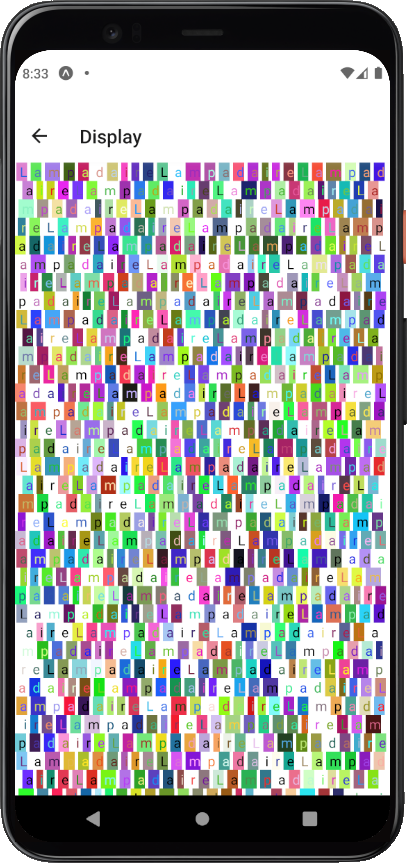

# colortxt
A **training exercice** for React Native.

## THE "better" branch is BETTER

displays a decomposed colored characters screen from a string

Devlopped with npm and expo.

The images resume it better than words

