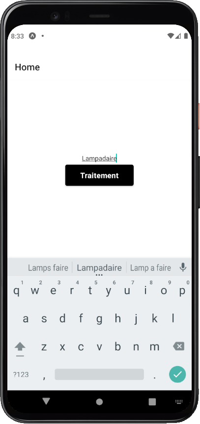

# colortxt
A **training exercice** for React Native.

## THE "better" branch is BETTER

displays a decomposed colored characters screen from a string

Devlopped with npm and expo.

The images resume it better than words

## better branch version:

to change the number of repetition you can change the size of the array in : ` var array =  Array.from(Array(100).keys()); //build an array of 100 numbers`
